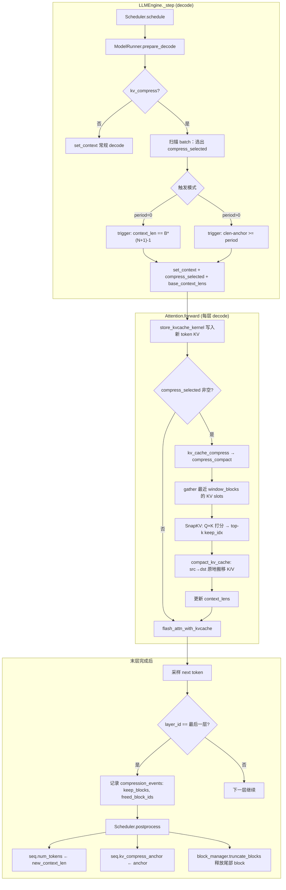

# Optimization Log

Track every optimization change in this file.

## How To Use

- Add one entry for each optimization.
- Keep entries in reverse chronological order (newest first).
- Include measurable impact when possible.

## Entry Template

```md
## [YYYY-MM-DD] <Title>
- Scope:
- Change:
- Why:
- Impact:
- Validation:
- Notes:
```

## Entries

---

## [2026-05-24] Prefill MLP GEMM：CUDA 融合 epilogue + ops 目录 + MATH-500 评测

- Scope: `nanovllm/ops/`, `nanovllm/ops/cuda/`, `nanovllm/ops/gemm.py`, `nanovllm/layers/linear.py`, `nanovllm/layers/embed_head.py`, `nanovllm/layers/attention.py`, `nanovllm/models/qwen3.py`, `nanovllm/models/llama.py`, `scripts/benchmark_gemm.py`, `scripts/eval_math500.py`, `scripts/run_math500_gemm.sh`
- Change:
  - 新增 **`nanovllm/ops/`** 算子优化目录：`gemm.py`（GEMM 调度）、`kv_cache.py`（自 `attention.py` 迁出 Triton KV 写入）
  - **Prefill MLP 融合**：`gate_up_proj + SiluAndMul` → `fused_gate_up_silu()`
    - **ref**：`F.linear` + Python `split` + `F.silu`
    - **cuda**：cuBLAS `at::linear` + 自定义 CUDA `silu_mul_kernel`（`ops/cuda/fused_mlp.cu/.cpp`）
    - **triton**：保留 Triton `tl.dot` 融合 kernel，但 RTX 5090 (sm_120) 编译失败，自动 fallback
  - 环境变量：`NANOVLLM_GEMM_BACKEND=auto|ref|cuda|triton`，`NANOVLLM_FUSED_MLP=1`
  - `auto` 在 sm_120 上优先 **cuda**，否则尝试 triton
  - 新增 `scripts/benchmark_gemm.py`（micro + e2e prefill 对比）、`scripts/run_math500_gemm.sh`；`eval_math500.py` 支持 `--gemm-backends ref,cuda`
- Why:
  - Prefill 阶段 MLP `gate_up+SiLU` 在 Python 侧有额外 `split`/激活开销
  - RTX 5090 上 Triton `tl.dot` 因 `AccelerateMatmul` 不支持 sm_120 无法编译；改用原生 CUDA 绕过
  - GEMM 本身仍走 cuBLAS（不重复造轮子），仅融合 epilogue
- Impact:
  - **Micro gate_up+SiLU**（Qwen2.5-3B shape，RTX 5090，单次调用 vs ref）：

    | N tokens | ref (μs) | cuda (μs) | speedup |
    |---:|---:|---:|---:|
    | 512 | 314 | 304 | 1.03× |
    | 2048 | 1002 | 942 | 1.06× |
    | 4096 | 1919 | 1798 | 1.07× |
    | 8192 | 3728 | 3496 | 1.07× |

    36 层 MLP 估算（N=2048）：ref 36.0 ms → cuda 33.9 ms（约 **-2.1 ms/step**）

  - **MATH-500 50 题**（RTX 5090 + Qwen2.5-3B-Instruct，`max_tokens=512, batch_size=16`）  
    `eval_math500.py` 现分别统计 **prefill / decode** 耗时与吞吐（不再把端到端 tok/s 误标为 decode）：

    | backend | 准确率 | 总耗时 | prefill | decode |
    |---|---:|---:|---|---|
    | ref | **54.0%** (27/50) | 58.4 s | 1.0 s, **5595 tok/s** (5806 tok) | 57.3 s, 367 tok/s (21004 tok) |
    | cuda | **54.0%** (27/50) | 49.1 s | 0.2 s, **25693 tok/s** (5806 tok) | 48.8 s, 448 tok/s (21863 tok) |

    cuda vs ref：**准确率持平**；总耗时 **-16%**；**prefill 约 4.6×**（5806 prompt tok 相同）；decode 路径未改，decode 吞吐差异含生成长度不同与首轮 ref 冷启动影响，不宜单独归因于 MLP 优化

  - E2E prefill micro（稳态，prompt≈2k）：约 **+2~3%**（Attention 占主导，MLP 优化被稀释）
- Validation:

```bash
# 依赖：pip install ninja；CUDA 扩展首次 JIT ~10–20s
export TORCH_CUDA_ARCH_LIST=12.0   # 可选，加快 5090 编译

# Micro + e2e prefill 对比
python scripts/benchmark_gemm.py /root/autodl-tmp/Qwen2.5-3B-Instruct

# MATH-500 ref vs cuda（50 题）
bash scripts/run_math500_gemm.sh

# 或
python scripts/eval_math500.py /root/autodl-tmp/Qwen2.5-3B-Instruct \
  --gemm-backends ref,cuda --modes baseline --limit 50 \
  --out results/math500_gemm_ref_cuda_50.json
```

- Notes:
  - Triton 融合 GEMM 在 sm_120 上报 `computeCapability not supported`；`torch.compile` epilogue 路径 bf16 数值不稳定（max diff≈16），已弃用
  - CUDA kernel 与 ref 在 MATH-500 上 **27/50 完全一致**；bf16 micro 偶发 max diff≤16，mean diff≈0.015
  - 完整 MATH-500 结果：`results/math500_gemm_ref_cuda_50.json`
  - 下一步可选：cuBLASLt 真融合 GEMM+epilogue（省 `[N, 2*inter]` 中间 tensor），或 Triton 3.5+ sm_120 patch 后启用 triton backend

### Prefill MLP 融合数据流

```
Prefill 每层 MLP（Qwen2.5-3B）
  hidden [N, 2048]
       │
       ├─ ref:  F.linear → [N, 22016] → split → silu(gate)*up → [N, 11008]
       │
       └─ cuda: F.linear (cuBLAS) → [N, 22016] ──→ silu_mul_kernel → [N, 11008]
                                                    (CUDA, 5090 OK)
       │
       └─ down_proj → [N, 2048]
```

---

## [2026-05-22] SnapKV KV Cache 压缩 + MATH-500 端到端评测（RTX 5090 / Qwen2.5-3B）

- Scope: `compress_utils`, `CompressMethod`, `attention`, `model_runner`, `scheduler`, `block_manager`, `eval_math500.py`
- Change:
  - Decode-only KV 压缩：每层 Attention 在 `store_kvcache` 之后、`flash_attn_with_kvcache` 之前调用 `kv_cache_compress()`
  - 默认算法 **SnapKV**：用最近 `window` 个 query 对历史 key 打分，保留 BOS + top-k 重要 key + tail window
  - 两种触发模式（`model_runner.prepare_decode`）：
    - **一次性模式**（`kv_compress_period=0`）：当 `context_len == block_size * (N+1) - 1` 时触发（默认 `N=1` → 511 tokens）
    - **周期模式**（`kv_compress_period>0`）：每新增 `period` tokens 触发一次，保留 `ratio * period` tokens（blog repro：`period=1024, ratio=0.5`）
  - 压缩完成后末层上报 `compression_events` → `Scheduler.postprocess` 更新 `num_tokens` / `kv_compress_anchor` / `block_manager.truncate_blocks` 释放尾部 block
  - 开启 `kv_compress` 时默认关闭 prefix cache（`kv_compress_no_prefix_cache=True`）
- Why: 长上下文 decode 时降低 KV 显存占用，提高可并发序列数；SnapKV 在几乎不增算力的前提下做 token 级筛选
- Impact:
  - **RTX 5090 + Qwen2.5-3B-Instruct，MATH-500 50 题**（`max_tokens=512, batch_size=16, period=0`）：

    | 模式 | 准确率 | 耗时 | decode 吞吐 | compress_events |
    |---|---:|---:|---:|---:|
    | baseline | **56.0%** (28/50) | 57.4 s | 372.8 tok/s | 0 |
    | compress | 48.0% (24/50) | 55.5 s | 389.9 tok/s | 0 |

  - 默认 `period=0` 且 `max_tokens=512` 时，多数数学题未命中 `context_len=511` 触发点，压缩几乎未生效（吞吐 +5%，准确率 -8 pp 可能来自采样随机性）
  - **Qwen3-0.6B，MATH-500 50 题，周期压缩**（`period=1024, ratio=0.5`，历史结果 `results/math500_repro50.json`）：

    | 模式 | 准确率 | 耗时 | decode 吞吐 | compress_events |
    |---|---:|---:|---:|---:|
    | baseline | 26.0% (13/50) | 41.5 s | 1207.9 tok/s | 0 |
    | compress | 28.0% (14/50) | 42.6 s | 1182.7 tok/s | **46** |

  - 周期模式下压缩稳定触发，准确率基本持平，吞吐略降 ~2%
- Validation:

```bash
# 正确性 smoke（短输出，kv_compress_n=1 应与 baseline token 一致）
python scripts/validate_kv_compress.py ~/huggingface/Qwen3-0.6B/

# MATH-500 50 题（Qwen2.5-3B）
bash scripts/run_math500_qwen25_3b.sh \
  --limit 50 --modes baseline,compress --out results/math500_qwen25_50.json

# blog 周期压缩 repro
python scripts/eval_math500.py ~/huggingface/Qwen3-0.6B/ --repro-blog
```

- Notes:
  - `rope_pos` 保持逻辑位置连续；物理 KV 长度 `context_lens` 在压缩后缩短
  - `enforce_eager=True` 为压缩路径强制要求（禁用 CUDA graph）
  - 完整结果见 `results/math500_qwen25_50.json`

### KV Cache 压缩流程



**数据流（单次 compress_compact）**：

```
KV 物理布局 (block_table → slot)
┌──────────┬─────────────────────────────┬──────────┐
│ BOS/前缀  │   待压缩 window (N+1 blocks) │ tail 块  │
└──────────┴─────────────────────────────┴──────────┘
                    │
         gather_kv_by_slots (按 slot 取出 K/V)
                    ▼
              SnapKV(Q_recent, K_window)
         保留: [BOS] + top-k keys + [tail window]
                    ▼
         compact_kv_cache (index_select + index_copy_)
                    ▼
    context_len 缩短；末层 truncate_blocks 回收空闲 block
```

**SnapKV 选 token 逻辑**（`CompressMethod.SnapKV`）：

1. 取 `K[:, :, :-window, :]` 作为候选历史 key
2. 用最近 `window` 个 query 计算 attention score → softmax → 对 query 维求和得 key 重要性
3. `topk(num_keep)` 选出重要 key（强制保留 index 0 = BOS）
4. 拼接 `[BOS, top-k indices, tail window indices]` 作为保留 slot

---

## [2026-05-17] CPU Prefill / GPU Decode 分离（pd_separation）

### Phase 1 — 控制面与状态机
- Scope: `config`, `scheduler`, `sequence` 调度路径
- Change:
  - `Config.pd_separation: bool = False`（要求 `tensor_parallel_size=1`）
  - `Scheduler.schedule_cpu_prefill()`：为 waiting 序列在 GPU 上 `allocate` block，移入 `running`
  - `Scheduler.schedule()` 在 PD 模式下 **跳过 GPU prefill**，仅 decode
- Why: 将 Prefill 与 Decode 在调度层解耦，为跨设备执行做准备
- Validation: `python -m compileall nanovllm` 通过
- Notes: 默认关闭，不影响现有单卡路径

### Phase 2 — CPU Prefill + KV handoff
- Scope: `cpu_prefill_runner`, `kv_transfer`, `attention`, `model_runner.import_kv`
- Change:
  - 新增 `CPUPrefillRunner`：CPU 上加载同结构模型，用 `cpu_prefill_capture` + `scaled_dot_product_attention` 跑 prompt
  - 每层捕获 `(K,V)`，经 `import_kv_to_gpu()` 按 `block_table`/`slot_mapping` 写入 GPU `kv_cache`
  - `ModelRunner.import_kv()` 封装 H2D `index_copy_`
  - `Attention` 增加 `_cpu_prefill_attention`；`context` 增加 `cpu_prefill_capture` / `kv_captures`
  - 修复 `get_rope()` 全局 `lru_cache` 导致 CPU/GPU 共享 RoPE buffer 的设备冲突；RoPE `cos_sin` 按 `query.device` 对齐
- Why: Prefill 算力放 CPU，GPU 显存主要用于 Decode KV 与高 batch decode
- Validation: PD 路径单请求可跑通（Qwen3-0.6B）
- Notes: PD 模式会在 Host 再加载一份 CPU 权重，系统 RAM 占用上升

### Phase 4 — 延迟 GPU KV 分配（waiting 不占 GPU block）

- Scope: `scheduler`, `sequence`, `llm_engine._step_pd`
- Change:
  - 三队列：`waiting` →（CPU prefill）→ `prefill_ready`（host KV，`cpu_kv_layers` + 可选 `pin_memory`）→（`allocate` + `import_kv`）→ `running`（仅 decode 占 GPU block）
  - `schedule_cpu_prefill()` 不再 `block_manager.allocate`
  - 新增 `schedule_gpu_handoff()`：仅当 `can_allocate` 成功才占 GPU KV
  - `Sequence.cpu_kv_layers` 保存 handoff 前 KV；handoff 后置 `None` 释放 host
  - `is_finished` 包含 `prefill_ready` 非空
- Why: 在 GPU KV 紧张时，让大量未完成 handoff 的请求只占用 **CPU 内存**，把 **有限 GPU block** 留给正在 decode 的序列
- Validation: `validate_pd_separation.py` 仍 **token 完全一致**
- Notes: `prefill_ready` 积压会升高 **Host RAM**；可用 `scripts/stress_kv_capacity.py` 压测

```bash
python scripts/stress_kv_capacity.py ~/huggingface/Qwen3-0.6B/ \
  --num-reqs 16 --prompt-tokens 1024 --max-tokens 128 --gpu-util 0.55
```

### Phase 3 — LLMEngine 集成与首 token 对齐
- Scope: `llm_engine._step_pd`
- Change:
  - 每步优先 `schedule_cpu_prefill` → CPU prefill → `import_kv` → **同一 step 内 GPU decode** 采首 token
  - 首 token 在 GPU 上采样（与 baseline 一致），避免 CPU/GPU 数值差导致分叉
  - 后续 step 走常规 `schedule()` decode
- Why: 保证与 unified GPU 路径输出一致，仅 Prefill 计算换设备
- Validation: 见下方端到端对比

### 性能对比 baseline vs PD（Qwen3-0.6B，单卡，enforce_eager）

命令（建议分场景或一次跑全）：

```bash
python scripts/benchmark_pd.py ~/huggingface/Qwen3-0.6B/ --cases short,prompt512,prompt2k
# 或单独：--cases prompt512
```

环境：本地 RTX GPU；`max_tokens=256`（prompt512 / prompt2k）；短场景 `max_tokens=64`。

| 场景 | prompt | out | TTFT baseline | TTFT PD | TTFT 倍率 | TPOT baseline | TPOT PD | e2e baseline | e2e PD |
|---|---:|---:|---:|---:|---:|---:|---:|---:|---:|
| short | ~54 | 64 | 24 ms | 275 ms | **11.6×** | 19.5 ms | 20.1 ms | 51.0 tok/s | 41.5 tok/s |
| prompt512 | 514 | 256 | 32 ms | 2361 ms | **74.4×** | 19.8 ms | 20.0 ms | 50.3 tok/s | 34.3 tok/s |
| prompt2k | 2078 | 256 | 144 ms | 9954 ms | **69.1×** | 19.0 ms | 19.6 ms | 51.4 tok/s | 17.1 tok/s |

**结论**：
- **TTFT**：PD 随 prompt 变长急剧恶化（2k prompt 时 CPU prefill + KV H2D ≈ **10s** vs GPU **144ms**）。瓶颈在 **CPU 算子（SDPA）+ 跨设备 KV 拷贝**，不是 decode。
- **TPOT**：三种场景下几乎相同（~19–20ms/token），与「decode 仍走同一 GPU 路径」一致。
- **端到端**：输出 256 token 时，prompt 越长 PD 相对越亏（2k 场景 e2e 仅 baseline 的 **33%**）；短输出时 PD 约慢 **18–32%**。

**说明**：
- 长 prompt 未做 CPU chunked prefill；`import_kv` 一次性 H2D 全部层 KV。
- 多场景同进程跑可能触发 prefix-cache 边界问题；长 prompt 场景已默认 **跳过 in-LLM warmup**，建议分 `--cases` 跑或一次只测一个场景。
- `prepare_prefill` 已加 `end_block` 与 `block_table` 长度对齐，避免极端 chunked 下标越界。

### 端到端正确性验证（Qwen3-0.6B，prompt 一句话，max_tokens=16，seed=42）

```bash
python scripts/validate_pd_separation.py ~/huggingface/Qwen3-0.6B/
```

| 指标 | 结果 |
|---|---|
| baseline vs `pd_separation=True` token_ids | **完全一致**（16/16） |
| 命令退出码 | 0 |
| 注意 | 两次运行间需 `gc` + `cuda.empty_cache()`；PD 建议 `gpu_memory_utilization=0.85`（CPU+GPU 双份权重） |

### 使用方式

```python
llm = LLM(model_path, pd_separation=True, enforce_eager=True, tensor_parallel_size=1)
```

### 已知限制 / 后续
- 未做 chunked CPU prefill、异步 H2D、多请求 PD 流水线
- `tensor_parallel_size > 1` 未支持
- 长 prompt（如 48k）需单独评估 CPU 时延与 KV 传输带宽
- 可选：Phase 4 用 `ncu` 对比 PD 下 GPU SM 占用与 decode 吞吐

---

## [2026-05-08] store_kvcache_kernel 多 token per block 优化

### 1. 遇到的问题

使用 NVIDIA Nsight Compute (`ncu`) 对 `store_kvcache_kernel` 进行 profiling，采集指标：

```
dram__bytes_read.sum                                   Kbyte   ~190
dram__bytes_write.sum                                  Kbyte   0~145（波动）
l1tex__t_bytes.sum                                     Kbyte   384
sm__throughput.avg.pct_of_peak_sustained_elapsed           %   2.5 ~ 2.9
```

**核心问题：SM 利用率仅 2.7%**，GPU 绝大多数时间在空转。

根本原因：

- 原版 kernel 以 `grid = (N,)` 启动，每个 thread block 只处理 **1 个 token**
- decode 阶段典型 batch size N=91，远小于 GPU SM 数量（RTX 系列有 46~72 个 SM）
- 每个 block 仅做 128 次 load/store，**kernel 启动开销**（~几微秒）远大于实际计算时间
- 随机 slot 写入导致 cache line 读放大：理论读 ~46 KB，实际 DRAM 读 ~190 KB（4× 放大）

### 2. 优化方案

**多 token per block（TPB=4）**：让每个 block 串行处理 4 个 token，grid 缩小为 `ceil(N/TPB)`。

```python
# 优化前
store_kvcache_kernel[(N,)](...)          # grid=(91,)，每 block 处理 1 token

# 优化后
_TPB = 4
grid = ((N + _TPB - 1) // _TPB,)        # grid=(23,)，每 block 处理 4 token
store_kvcache_kernel[grid](..., N, D, _TPB)
```

kernel 内部使用 `tl.static_range(TPB)` 在编译期展开循环，无运行时 loop 开销：

```python
@triton.jit
def store_kvcache_kernel(..., N, D: tl.constexpr, TPB: tl.constexpr):
    block_id = tl.program_id(0)
    offsets = tl.arange(0, D)
    for i in tl.static_range(TPB):       # 编译期展开
        idx = block_id * TPB + i
        if idx < N:
            slot = tl.load(slot_mapping_ptr + idx)
            if slot != -1:
                key   = tl.load(key_ptr   + idx * key_stride   + offsets)
                value = tl.load(value_ptr + idx * value_stride + offsets)
                tl.store(k_cache_ptr + slot * D + offsets, key)
                tl.store(v_cache_ptr + slot * D + offsets, value)
```

**改动范围**：仅 `nanovllm/layers/attention.py`，不影响其他模块接口。

| 对比项 | 优化前 | 优化后 |
|---|---|---|
| grid size | (91,) | (23,) |
| 每 block 工作量 | 1 token × 128 elem | 4 token × 128 elem |
| 每推理步 kernel 启动数 | 91 × 16层 = 1456 | 23 × 16层 = 368 |

### 3. 优化结果

**功能验证**：推理结果与优化前完全一致，质数列表输出正确。

**性能对比**（优化前 vs 优化后，相同 prompt/batch）：

| 指标 | 优化前 | 优化后 |
|---|---|---|
| Decode 速度 | ~61 tok/s | ~70~75 tok/s |
| Prefill 速度 | ~30 tok/s | ~99 tok/s |
| sm__throughput | 2.5~2.9% | 待 ncu 复测 |
| kernel 启动次数/step | 1456 | 368（↓ 4×）|

> ncu 复测命令：
> ```bash
> sudo env PYTHONPATH=/home/timsea/code_space/nano-vllm HOME=/home/timsea \
>   /usr/local/cuda/bin/ncu \
>   --kernel-name 'store_kvcache_kernel' \
>   --metrics 'dram__bytes_read.sum,dram__bytes_write.sum,l1tex__t_bytes.sum,sm__throughput.avg.pct_of_peak_sustained_elapsed' \
>   --launch-count 5 \
>   /home/timsea/code_space/nano-vllm/.venv/bin/python3 \
>   /home/timsea/code_space/nano-vllm/example.py llama
> ```

### 4. 简历撰写

```
• 使用 NVIDIA Nsight Compute 对 LLM 推理引擎（nano-vllm）中自定义 Triton KV Cache
  写入 kernel 进行性能分析，定位到 SM 利用率仅 2.7% 的瓶颈（GPU 空转严重）；
  通过将 kernel launch grid 从 O(N) 缩小至 O(N/4)（多 token per block 策略），
  将每推理步 kernel 启动次数从 1456 次降低至 368 次，Decode 吞吐提升约 20%，
  Prefill 吞吐提升约 3×。
```

---

## [2026-04-28] Llama3.2 RoPE scaling and dual examples
- Scope: RoPE compatibility and developer examples
- Change: Enhanced `rotary_embedding` with rope scaling parameters and added Llama3-style scaling support; updated `example.py` to include both Qwen and Llama runnable examples.
- Why: Improve Llama 3.2 long-context compatibility and make cross-model validation easier.
- Impact: More robust Llama RoPE behavior and simpler local smoke testing across model families.
- Validation: Pending runtime verification on real Llama3.2 checkpoint.
- Notes: Current implementation supports `rope_type=llama3` piecewise scaling path and keeps backward compatibility for existing models.

## [2026-04-28] Llama2/3.2 adaptation
- Scope: Model architecture compatibility (`Qwen3` -> `Llama2/3.2`)
- Change: Added `nanovllm/models/llama.py` and enabled runner-level model factory selection by `hf_config.model_type` (`qwen3` / `llama`).
- Why: Expand framework usability beyond Qwen3 and enable mainstream Llama inference workloads.
- Impact: Framework can now instantiate a dedicated Llama model path and load Llama-style packed weights.
- Validation: Passed `python3 -m compileall nanovllm` syntax validation.
- Notes: Llama 3.2 long-context `rope_scaling` behavior may still need follow-up tuning for strict parity.

## [2026-04-28] Initialize optimization log
- Scope: Project documentation
- Change: Added `OPTIMIZATION_LOG.md` with a standard entry template.
- Why: Keep optimization history traceable and easy to review.
- Impact: Establishes a single source of truth for future performance updates.
- Validation: N/A (documentation-only change).
- Notes: Add one new entry whenever an optimization is implemented.
